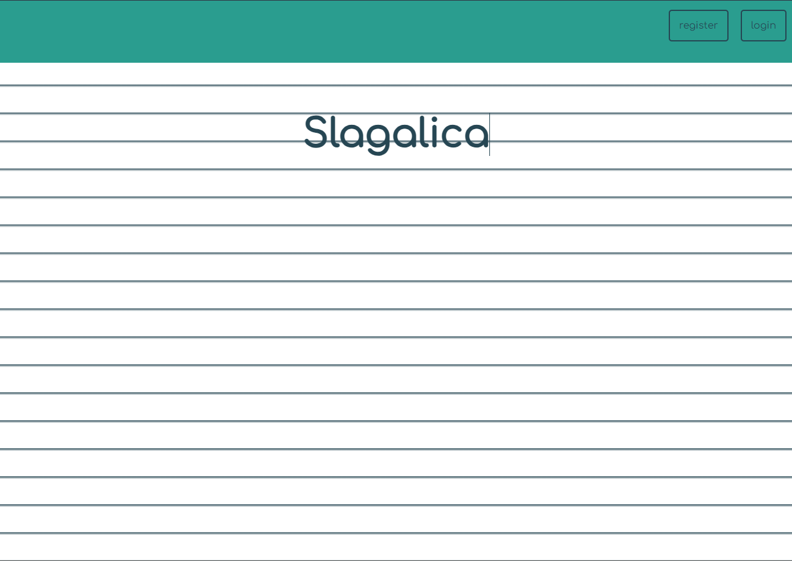
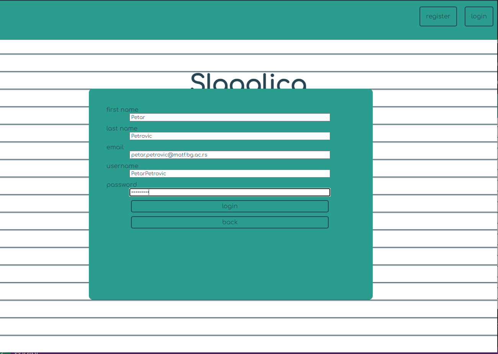
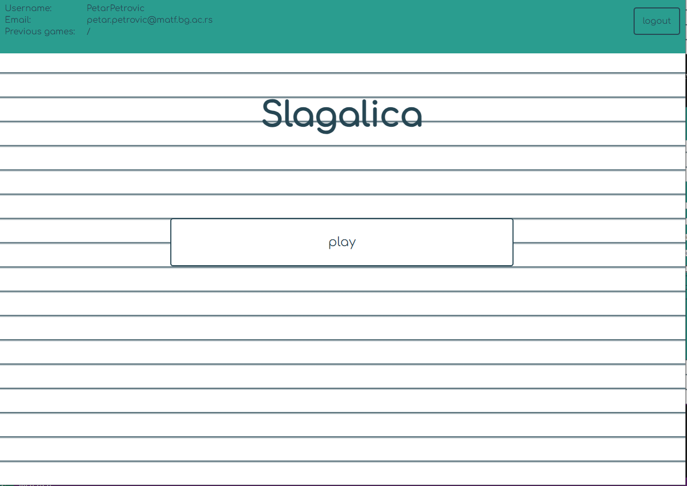
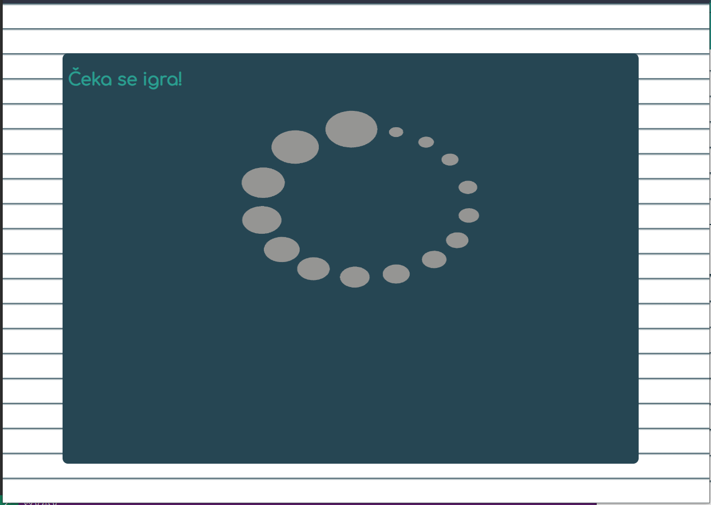
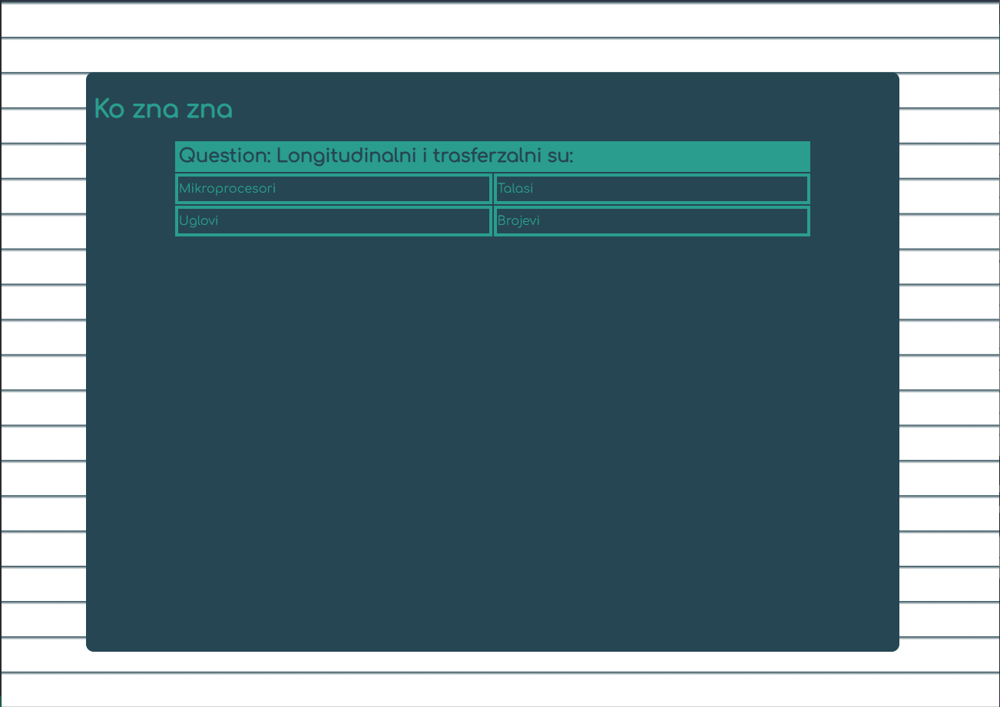

# Slagalica
Studentski projekat iz predmeta Razvoj softvera 2. Mikroservisna aplikacija popularne igre *Slagalica* sa *multiplayer* funkcionalnošću. 
## Učesnici
 - Milica Gnjatović (1062/2022)
 - Bojan Bardžić (1072/2022)
## Tehnologije
Frontend aplikacije je iplementiran korišćenjem radnog okvira **Angular**, dok je backend aplikacije rađen u programskom jeziku **C#** korišćenje radnog okvira **.NET**.

Takođe je projekat kontejnerizovan korišćenjem **Docker** alata.
## Mikroservisi
Mikroservisi od kojih se sastoji ova aplikacija su:
  - **IdentityServer** (server za logovanje)
  - **GameServer** (server za igranje)
  - **WhoKnowsKnows** (igra ko zna zna)
  - **Frontend** (*single-page* aplikacija napravljena u Angularu)

## Dokumentacija
Da biste otvorili dokumentaciju otvorite fajl  ``docs/html/index.html``.

## Uputstvo za korišćenje aplikacije

Da biste pokrenuli *backend* aplikacije pozicionirajte se u terminal u folder ``Slagalica`` unutar projekta. Zatim pokrenite sledeće komande:

```
docker-compose build
docker-compose up -d
```

Zatim kada je *backend* pokrenut premestite se u folder ``SlagalicaSPA`` u projektu, i pokrenite sledeće komande:
```
docker build -t angular
docker run -p 4200:4200 angular
```

Zatim otvorite svoj veb pregledač u dva prozora i pristupite adresi ``http://localhost:4200``

Treblao bi da se pojavi sledeća slika:



Sledeće što treba uraditi je da se otvori nalog klikom na dugme **register**, popunite podatke i kliknete na dugme **login**.



Kada ste ulogovani, poslednje što treba uraditi je kliknuti na dugme **play**.



Da bi igra počela potrebno je da na oba prozora u pregledaču pritisnete dugme play. Kada server pronađe par igrača za igru on vam šalje pitanja i igra može da počne.




U svakom trenutku, kada niste u toku igre, se možete odjaviti pritiskom na dugme **logout**. Ukoliko želite da se prijavite sa postojećim nalogom to možete učiniti pritiskom na dugme **login**.